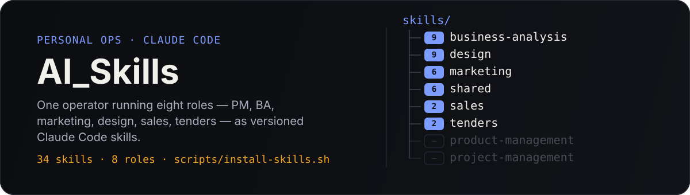

<p align="center">
  
</p>

<p align="center">
  <sub>Private skill library · not a public product · one operator, eight roles</sub>
</p>

## What this is

A single Claude Code user acting as PM, BA, marketer, designer, salesperson, and tender writer needs the right specialist behavior on demand — not one generalist prompt trying to be all of them. This repo is the versioned source of truth for that: skills sourced from the open agent-skills ecosystem, sorted into the role that uses them, and synced into the Claude Code runtime with one script.

`skills/` is the backup and the audit trail. `~/.claude/skills/` is the live copy Claude Code actually reads. This repo exists so the live copy is never the only copy.

## Roles and what they cover

| Role | Folder | Handles |
| --- | --- | --- |
| Business Analyst | `business-analysis/` | BRDs, FRS, use cases, user stories, acceptance criteria, process/data-flow diagrams |
| Web/Frontend Designer | `design/` | landing pages, UI polish, motion, README/asset design, animation review |
| CMO / Marketing | `marketing/` | competitor profiling, customer research, positioning, product copy |
| Presale / Sales | `sales/` | discovery calls, objection handling |
| Tender / Proposal | `tenders/` | proposal writing, RFP/RFI response |
| Shared | `shared/` | research, skill discovery, browser automation, cross-role utilities |
| Product Manager | `product-management/` | reserved — not populated yet |
| Project Manager | `project-management/` | reserved — not populated yet |

Every folder under a role is one skill: a self-contained directory with a `SKILL.md` declaring its `name` and `description`. Skill names are unique across the whole tree, because the installer flattens everything into one runtime folder.

## How a skill gets here

```text
public agent-skills repo  →  skills/<role>/<name>/  →  ~/.claude/skills/<name>/
        (found via              (versioned,               (what Claude Code
      find-skills skill)         backed up here)              runs from)
```

1. The `find-skills` skill searches the open skills ecosystem (skills.sh / `npx skills`) for a candidate that solves a real, recurring need in one of the roles above.
2. Once it proves useful, its folder is copied into the matching `skills/<role>/` directory here — that's the versioning and backup step.
3. `scripts/install-skills.sh` syncs everything from `skills/` into the live `~/.claude/skills/` runtime folder.

## Quickstart

```bash
git clone https://github.com/Ejokey/AI_Skills.git
cd AI_Skills
./scripts/install-skills.sh
```

Restart Claude Code, then invoke a skill by name or description — e.g. "use brd-creation to draft a BRD for this feature."

To pull in a change made directly under `~/.claude/skills`, or after a `git pull`, just re-run the script — it wipes and replaces each matching folder, so it's safe to run any time skills drift out of sync:

```bash
git pull
./scripts/install-skills.sh
```

## Conventions

- One folder = one skill; every skill folder has a `SKILL.md` with `name` + `description` frontmatter.
- Skill `name` is unique across the entire tree — the installer is flat, so a collision in two roles silently overwrites one.
- `projects/` holds one folder per client or initiative — context, working docs, and outputs. It's excluded from this README because it's working material, not the library itself.
- New skills are added role-first: decide which hat is wearing it before deciding where the code lives.
